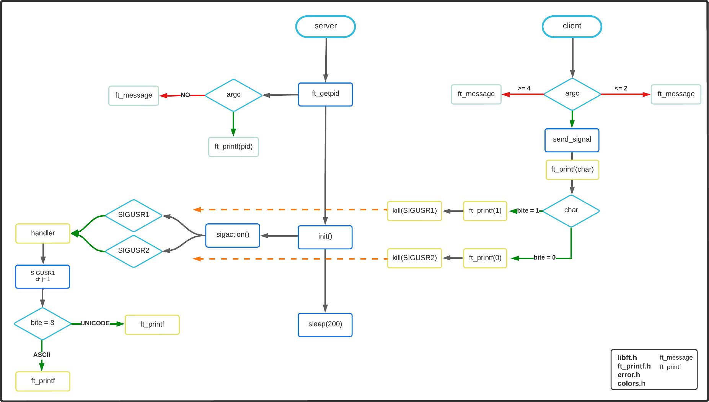

<h1 align="center">
  
  
	minitalk
</h1>
 <p align="center">


</p>

<h1 align="center">

<!--  -->
</h1>

 Funciones permitidas

 `sigemptyset` , `sigaddset` , `sigaction` , `kill` , `getpid` , `malloc` , `free` , `pause` , `sleep` , `usleep` , `exit`


# Procesos en Unix

Proceso es la instancia de un programa, se pueden crear **n** cantidades de instancias según ejecuciones del programa.

Todos los procesos poseen 4 atributos para poder gestionarlos.

| 	| 	|
| --- | --- |
| PID | ***(Process ID)*** Identificador único para cada proceso. conformado por 5 numeros enteros |
| PPID | ***(Parent Process ID)*** En Unix, cada proceso es creado, por un proceso, este seria el proceso padre.
| TTY | Terminal a la que esta asociada el proceso, no todos los procesos son creados en terminal, puede haber procesos sin TTY. |
| UID | ***(User ID)*** Usuario al que pertenece el proceso.

Listar todos los procesos.

	ps

Listar los procesos con el PPID

	ps -f

## Finalizar un proceso

Para finalizar un proceso tenemos dos formas, pulsando **ctrl + C** o localizando el PID

	kill -9 <PID>

### [getped()](https://github.com/nach131/minitalk/blob/main/funciones/kill/iniciate.c)

### [kill process](https://github.com/nach131/minitalk/blob/main/funciones/kill/kill_process.c)

# Signals

Los signals son la método por el cual podemos comunicar procesos entre si (las señales).
Para conocer los signals disponibles en el sistema

	kill -l

Cada señal tiene un numero entero que la representa, y un nombre.
|	|	|	|	|
| -- | -- | -- | -- |
| 1) SIGHUP   |   2) SIGINT    |  3) SIGQUIT    |   4) SIGILL |
| 5) SIGTRAP  |   6) SIGABRT   |  7) SIGEMT     |   8) SIGFPE |
| 9) SIGKILL  |  10) SIGBUS    | 11) SIGSEGV    |  12) SIGSYS |
| 13) SIGPIPE |   14) SIGALRM  |  15) SIGTERM   |   16) SIGURG |
| 17) SIGSTOP |   18) SIGTSTP  |  19) SIGCONT   |   20) SIGCHLD |
| 21) SIGTTIN |   22) SIGTTOU  |  23) SIGIO     |   24) SIGXCPU |
| 25) SIGXFSZ |   26) SIGVTALRM|  27) SIGPROF   |   28) SIGWINCH |
| 29) SIGINFO |   30) SIGUSR1  |  31) SIGUSR2 |  |

|	Numero | Nombre| Descripción|
| -- | -- | -- |
| 1 | SIGHUP | Cuelgue del terminal o proceso terminado |
| 2 | SIGINT | Emitido si el usuario interrumpe el proceso ***Ctrl + C***|
| 3 | SIGQUIT | Emitido si el usuario envía señal de salida ***Ctrl + D***| Puntero
| 8 | SIGFPE | Emitido si se intenta operación matemática prohibida |
| 9 | SIGKILL | Permite cerrar un proceso y no realiza ninguna operación de limpieza |
| 14 | SIGALRM | Emitido cuando el timer asociado a la función alarm expira. También cuando el timer de intervalo es configurado (setitimer) |
| 15 | SIGTERM | Señal de terminación de software (enviada por kill por defecto) |
| 17 | SIGSTOP | similar a SIGTSTP pero no puede ser ignorada o capturada.|
| 18 | SIGTSTP | generada cuando presionamos ***Control + Z***. Puede ser ignorada.|
| 19 | SIGCONT | Emitido para reanudar un proceso que ha sido parado (suspendido) con SIGSTOP |
| 20 | SIGCHLD | Cuando un proceso termina o para, el proceso envía esta señal a su padre. Por defecto esta señal es ignorada. Normalmente el proceso padre invoca la función wait para obtener el estatus de término del proceso hijo. Se evita así la creación de procesos "zombies" |
| 30 | SIGUSR1 | Es una señal 1 definida por el usuario|
| 31 | SIGUSR2 | Es una señal 2 definida por el usuario|

# Signal()
 ```c
	 sig_t	signal(int sig, sig_t func);
```
### [signal()](https://github.com/nach131/minitalk/blob/main/funciones/signal.c)

Genera una señal en una variedad de eventos externos, se puede configurar para que se interrumpa y continuar donde se dejo.

 # sigaction()
```c
 int	sigaction(int sig, const struct sigaction *restrict act, struct sigaction *restrict oact);
```
Permite que el proceso de llamada examine o especifique la acción que se llevará a cabo al recibir una señal específica.

El argumento sig especifica la señal y se le puede asignar cualquiera de las señales especificadas en signal.h excepto SIGKILL y SIGSTOP.

>Si el argumento ***act*** no es ***NULL***, apunta a una estructura que especifica la nueva acción de entrega de **signal**
Si el argumento ***oact*** no es ***NULL*** apunta a una estructura donde la acción previamente asociada con **signal** almacenara el retorno de **sigaction**.
>

```c
	struct  sigaction {
             union __sigaction_u __sigaction_u;  /* controlador de señal */
             sigset_t sa_mask;               /* máscara de señal para aplicar */
             int     sa_flags;               /* Signal a continuación*/
     };
```
`sa_mask` Adicional asignación del bloqueo durante la ejecución de la función de captura 

`sa_flag` Aviso especial durante comportamiento de signal

Estructuras dentro de sigaction

```c
  union __sigaction_u {
             void    (*__sa_handler)(int);
             void    (*__sa_sigaction)(int, siginfo_t *,
                            void *);
     };
```


`sa_handler` Puntero de la función de captura 

`sa_sigaction` Puntero de la función de captura 